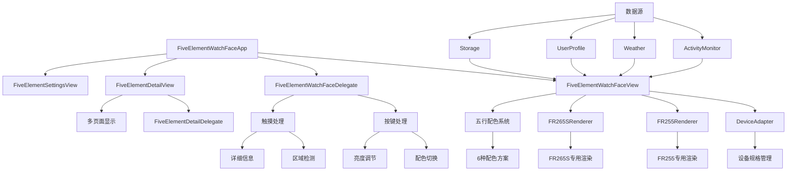

# 五行配色表盘 (Five Element Color Watch Face)

一个基于中国传统五行理论设计的Garmin智能手表表盘应用，融合了现代健康监测与古典哲学智慧。通过动态配色系统和智能交互设计，为用户提供独特的个性化表盘体验。

## 项目概述

### 核心特性

- **🎨 五行配色系统**: 基于金、木、水、火、土五行理论的6种配色方案（包含默认配色），支持手动切换
- **📊 健康数据集成**: 实时显示心率、步数、卡路里、电池电量等健康指标
- **🕐 智能时间显示**: 12小时制表盘，主要时间点（12、3、6、9）突出显示
- **🎯 智能交互**: 支持触摸、滑动、按键等多种交互方式，可切换配色和查看详细信息
- **⚙️ 个性化设置**: 丰富的自定义选项，支持数据显示开关、时间格式等配置
- **📱 多设备支持**: 专门适配FR965、FR255、FR265/265S、FR570、FR970等设备，采用独立渲染架构
- **🌍 多语言支持**: 支持中文和英文界面，包含中文字体资源
- **🔋 优化性能**: 针对不同设备屏幕尺寸和性能特点进行专门优化

### 技术架构

本项目采用模块化架构设计，基于Garmin Connect IQ SDK 4.0+开发，针对不同设备采用专门的渲染策略：

```
五行表盘应用架构
├── 应用层 (Application Layer)
│   ├── FiveElementWatchFaceApp - 应用主入口
│   └── 生命周期管理和设置变更处理
├── 视图层 (View Layer)
│   ├── FiveElementWatchFaceView - 主表盘视图
│   ├── FiveElementDetailView - 详细信息视图
│   └── FiveElementSettingsView - 设置界面视图
├── 控制层 (Controller Layer)
│   ├── FiveElementWatchFaceDelegate - 主表盘交互控制
│   ├── FiveElementDetailDelegate - 详细信息交互控制
│   └── FiveElementSettingsDelegate - 设置界面交互控制
├── 设备适配层 (Device Adaptation Layer)
│   ├── DeviceAdapter - 设备适配器，定义屏幕规格和缩放参数
│   ├── FR255Renderer - FR255专用渲染器，优化小屏幕显示
│   └── FR265SRenderer - FR265S专用渲染器，基于FR965逻辑适配
├── 数据层 (Data Layer)
│   ├── ActivityMonitor - 健康数据获取
│   ├── Weather - 天气数据获取
│   ├── UserProfile - 用户配置数据
│   └── Storage - 本地数据存储
└── 资源层 (Resource Layer)
    ├── 字符串资源 (多语言支持)
    ├── 图标资源 (SVG矢量图标)
    ├── 字体资源 (中文字体支持)
    └── 配置资源 (设置选项定义)
```

## 功能模块详解

### 🎨 五行配色系统

五行配色系统是本应用的核心特色，基于中国传统五行理论设计，实现了6种预定义配色方案：

| 配色方案   | 主色调           | 寓意               | 适用场景           |
| ---------- | ---------------- | ------------------ | ------------------ |
| 默认配色   | 经典黑白         | 简洁明了，通用性强 | 日常使用，商务场合 |
| 木 (Wood)  | 绿色系 (#4CAF50) | 生机勃勃，充满活力 | 运动健身，户外活动 |
| 火 (Fire)  | 红色系 (#F44336) | 热情奔放，能量充沛 | 工作学习，激情时刻 |
| 土 (Earth) | 黄色系 (#FF9800) | 稳重踏实，平衡发展 | 日常生活，稳定状态 |
| 金 (Metal) | 白色系 (#FFFFFF) | 清晰明亮，专注思考 | 商务场合，正式活动 |
| 水 (Water) | 蓝色系 (#2196F3) | 深邃宁静，内心平和 | 休息放松，冥想时光 |

**配色组成结构：**
每种配色方案包含完整的颜色定义：

- 背景色 (backgroundColor)
- 主色调 (primaryColor)
- 次要色 (secondaryColor)
- 主数字颜色 (primaryDigitColor)
- 其他数字颜色 (otherDigitColor)

**配色切换方式：**

- 🔘 按下UP键快速切换
- 🖱️ 点击表盘五行配色区域
- ⚙️ 设置界面手动选择
- 🔄 即时生效，设置自动保存

### 📊 健康数据监测

应用集成了核心健康监测功能，支持个性化显示控制：

**实时数据显示：**

- ❤️ **心率监测**: 实时心率数据，支持开关控制
- 👟 **步数统计**: 当日步数计数，支持开关控制
- 🔥 **卡路里**: 活动卡路里统计，支持开关控制
- 🔋 **电池电量**: 设备电量百分比显示，支持开关控制

**数据可视化特性：**

- **SVG图标系统**: 心率、步数、卡路里、电量专用矢量图标
- **数字化显示**: 清晰的数值展示，字体大小自适应
- **颜色编码**: 根据当前五行配色方案调整数据显示颜色
- **布局优化**: 针对不同设备屏幕尺寸优化数据布局
- **设置持久化**: 用户的显示偏好自动保存

**数据展示模式：**

- **标准模式**: 显示用户选择的健康数据项
- **自定义模式**: 通过设置界面控制各项数据的显示开关
- **详细信息**: 支持触摸查看更详细的健康数据页面

### 🕐 时间显示系统

**表盘设计特性：**

- 🕐 **12小时制表盘**: 标准12小时制布局设计
- 📍 **主要时间点**: 12、3、6、9点位置突出显示
- 🕐 **指针系统**: 传统指针式时间显示（时针、分针、秒针）
- 🔢 **数字时间**: 中心区域清晰的数字时间显示
- 📅 **日期信息**: 支持日期、农历、星期显示选项

**时间格式支持：**

- ⏰ **12/24小时制**: 支持时间格式切换
- 🌐 **多语言格式**: 中英文时间格式本地化
- 🗓️ **农历显示**: 可选的农历日期显示功能
- 📱 **自适应布局**: 根据设备屏幕尺寸自动调整显示

### 🌤️ 环境信息集成

**天气数据显示：**

- 🌡️ 当前温度显示（支持摄氏度/华氏度切换）
- 🌤️ 天气状况图标和描述
- 📍 基于GPS位置的本地天气信息
- ⚙️ 天气信息显示开关控制

### 🎯 智能交互设计

**触摸交互区域：**

```
表盘区域划分：
┌─────────────────────┐
│    五行配色区域      │ ← 点击切换配色方案
├─────────────────────┤
│                     │
│   中心时间显示区     │ ← 点击进入详细信息视图
│                     │
├─────────────────────┤
│  健康数据显示区域    │ ← 点击查看数据详情
└─────────────────────┘
```

**按键操作：**

- ⬆️ **UP键**: 切换五行配色方案
- ⬇️ **DOWN键**: 调整屏幕亮度
- 🔘 **SELECT键**: 重置配色到默认方案
- 📋 **MENU键**: 打开设置界面

**详细信息视图：**

- 📊 **健康数据页**: 显示详细的健康监测数据
- 🌤️ **天气信息页**: 显示完整的天气预报信息
- 🎨 **五行信息页**: 显示当前配色方案的五行理论说明
- ⬅️➡️ **页面切换**: 支持左右滑动或按键切换页面

**交互反馈：**

- ✨ **即时响应**: 所有交互操作立即生效
- 🔄 **状态保存**: 用户操作和设置自动保存
- 🎯 **精确触控**: 优化的触摸区域检测算法

## 架构设计与调用关系

### 🏗️ 系统架构图



### 🔄 核心类关系

#### 1. 应用主类 (FiveElementWatchFaceApp)

```
FiveElementWatchFaceApp
├── initialize() - 应用初始化
├── onStart() - 应用启动
├── onStop() - 应用停止
├── getInitialView() - 获取初始视图（返回FiveElementWatchFaceView）
├── getSettingsView() - 获取设置视图
└── onSettingsChanged() - 设置变更处理和视图刷新
```

#### 2. 主视图类 (FiveElementWatchFaceView)

```
FiveElementWatchFaceView
├── onUpdate() - 统一视图更新入口
├── onPartialUpdate() - 部分更新优化
├── loadSettings() - 从Application.Properties加载用户设置
├── getCurrentElementColors() - 获取当前五行配色方案
├── isRealFR265SDevice() - FR265S设备检测
├── renderFR255WatchFace() - FR255设备专用渲染
├── renderFR265SWatchFace() - FR265S设备专用渲染
├── renderFR965WatchFace() - FR965设备原始渲染
├── drawHourMarks() - 绘制小时刻度和数字
└── 资源管理 - 中文字体和SVG图标加载
```

#### 3. 设备适配系统

```
DeviceAdapter
├── getDeviceSpecs() - 获取设备规格
│   ├── screenWidth/Height - 屏幕尺寸
│   ├── isAMOLED - 是否AMOLED屏幕
│   ├── scaleFactor - 缩放比例
│   ├── fontScale - 字体缩放
│   └── pointerLengthRatio - 指针长度比例
├── getCurrentDeviceId() - 获取当前设备ID
└── 支持设备: fr965, fr255, fr265, fr265s, fr57042mm, fr57047mm, fr970

FR255Renderer
├── render() - FR255专用完整渲染
├── drawBackground() - 背景绘制
├── drawTimeMarks() - 时间刻度
├── drawCenterInfo() - 中心信息
├── drawHealthData() - 健康数据
└── drawPointers() - 指针绘制

FR265SRenderer
├── render() - FR265S专用渲染（基于FR965逻辑）
├── 继承FR965的显示逻辑
└── 针对FR265S屏幕尺寸优化
```

#### 4. 交互委托系统

```
FiveElementWatchFaceDelegate
├── onKey() - 按键事件处理
│   ├── KEY_UP - 切换五行配色
│   ├── KEY_DOWN - 调整亮度
│   └── KEY_SELECT - 重置配色
├── onTap() - 触摸事件处理
│   ├── 五行配色区域 - 切换配色
│   ├── 中心区域 - 进入详细视图
│   └── 数据区域 - 查看数据详情
└── 区域检测算法 - 精确的触摸区域判断

FiveElementDetailView
├── 多页面系统 - 健康、天气、五行信息
├── 页面常量定义 - PAGE_HEALTH, PAGE_WEATHER, PAGE_FIVE_ELEMENT
├── 布局常量 - 不同设备的布局适配
└── 阈值常量 - 数据显示的阈值设置

FiveElementDetailDelegate
├── onKey() - 详细视图按键处理
├── 页面切换逻辑
└── 返回主视图处理
```

### 📱 设置系统架构

**设置配置层次：**

```
设置系统
├── properties.xml - 默认配置定义
├── settings.xml - 用户界面配置
├── FiveElementSettingsView - 设置界面视图
└── FiveElementSettingsDelegate - 设置交互逻辑
    ├── 五行元素选择 (0-4)
    ├── 数据显示模式 (标准/简洁/详细)
    ├── 颜色主题 (经典/现代/简约)
    ├── 显示开关 (步数/心率/卡路里/电量/天气)
    ├── 时间格式 (12/24小时制)
    ├── 交互设置 (触觉反馈/自动切换)
    └── 电源管理 (省电模式/夜间模式)
```

## 开发环境搭建

### 系统要求

- **操作系统**: macOS 10.14+, Windows 10+, 或 Linux
- **Java**: JDK 8 或更高版本
- **IDE**: Visual Studio Code (推荐) 或其他支持Monkey C的编辑器
- **SDK**: Garmin Connect IQ SDK 4.0.6+

### 安装步骤

#### 1. 安装Connect IQ SDK

1. 访问 [Garmin开发者官网](https://developer.garmin.com/connect-iq/sdk/) `<mcreference link="https://developer.garmin.com/connect-iq/sdk/" index="3">`3`</mcreference>`
2. 下载并安装SDK Manager
3. 启动SDK Manager并完成初始设置
4. 登录Garmin Connect账户
5. 下载所需的SDK版本和设备支持包

#### 2. 配置开发环境

**Visual Studio Code配置:**

1. 安装VS Code
2. 安装"Monkey C"扩展插件 `<mcreference link="https://www.ottorinobruni.com/getting-started-with-garmin-connect-iq-development-build-your-first-watch-face-with-monkey-c-and-vs-code/" index="4">`4`</mcreference>`
3. 配置SDK路径和开发者密钥

**环境变量配置:**

```bash
# 设置环境变量
export CIQ_HOME=/path/to/connectiq-sdk
export PATH=$PATH:$CIQ_HOME/bin

# 验证安装
monkeyc --version
```

**生成开发者密钥:**

开发者密钥是 Garmin Connect IQ 开发的必需文件，用于应用签名和发布。

```bash
# 方法1: 使用 OpenSSL 生成（推荐）
# 生成 RSA 私钥
openssl genrsa -out developer_key.pem 4096

# 转换为 DER 格式（Garmin Connect IQ 所需格式）
openssl rsa -in developer_key.pem -outform DER -out developer_key.der

# 验证生成的文件
ls -la developer_key.*
```

```bash
# 方法2: 使用 SDK 工具生成（备选）
monkeyc -g developer_key.der
```

**重要说明：**
- `developer_key.der` 文件必须放在项目根目录
- 密钥文件已设置适当权限（600，仅所有者可读写）
- **请勿将密钥文件提交到公共代码仓库**
- 建议将 `developer_key.*` 添加到 `.gitignore` 文件中
- 如果缺少此文件，运行模拟器时会报错：`缺少必要文件: developer_key.der`

#### 3. 项目配置

克隆项目到本地：

```bash
git clone <项目地址>
cd garmin-IQ
```

检查项目结构：

```
five-color-garmin/
├── manifest.xml                    # 应用清单文件
├── monkey.jungle                   # 项目配置文件
├── README.md                       # 项目说明文档
├── docs/                          # 文档目录
│   ├── FIVE_ELEMENT_COLORS_API.md # 五行配色API文档
│   ├── PUBLISHING_GUIDE.md        # 发布指南
│   ├── PROJECT_CLEANUP_SUMMARY.md # 项目清理总结
│   └── store_description.md       # 应用商店描述
├── source/                        # 源代码目录
│   ├── FiveElementWatchFaceApp.mc      # 应用主类
│   ├── FiveElementWatchFaceView.mc     # 主视图类
│   ├── FiveElementWatchFaceDelegate.mc # 主视图交互委托
│   ├── FiveElementDetailView.mc        # 详细信息视图
│   ├── FiveElementDetailDelegate.mc    # 详细信息交互委托
│   ├── DeviceAdapter.mc               # 设备适配器
│   ├── FR255Renderer.mc               # FR255专用渲染器
│   └── FR265SRenderer.mc              # FR265S专用渲染器
└── resources/                     # 资源文件目录
    ├── strings/
    │   └── strings.xml            # 字符串资源
    ├── settings/
    │   ├── settings.xml           # 设置界面配置
    │   └── properties.xml         # 默认属性配置
    ├── fonts/                     # 字体资源
    │   └── (中文字体文件)
    └── drawables/                 # 图标资源
        └── (SVG图标文件)
```

## 设备支持

### 兼容设备列表

| 设备型号              | 屏幕尺寸 | 分辨率   | 支持状态    | 专用优化               |
| --------------------- | -------- | -------- | ----------- | ---------------------- |
| Forerunner 965        | 1.4"     | 454×454 | ✅ 完全支持 | 原始渲染路径           |
| Forerunner 255        | 1.3"     | 260×260 | ✅ 完全支持 | FR255Renderer专用渲染  |
| Forerunner 265        | 1.3"     | 416×416 | ✅ 完全支持 | 标准渲染               |
| Forerunner 265S       | 1.1"     | 360×360 | ✅ 完全支持 | FR265SRenderer专用渲染 |
| Forerunner 570 (42mm) | 1.2"     | 390×390 | ✅ 完全支持 | 标准渲染               |
| Forerunner 570 (47mm) | 1.3"     | 416×416 | ✅ 完全支持 | 标准渲染               |
| Forerunner 970        | 1.4"     | 454×454 | ✅ 完全支持 | 原始渲染路径           |

### 设备适配架构

#### DeviceAdapter规格定义

```
设备规格配置：
├── fr965: 454×454, AMOLED, 缩放1.0, 字体1.0, 指针0.85
├── fr255: 260×260, MIP, 缩放0.57, 字体0.8, 指针0.75
├── fr265: 416×416, AMOLED, 缩放0.92, 字体0.9, 指针0.8
├── fr265s: 360×360, AMOLED, 缩放0.79, 字体0.85, 指针0.75
├── fr57042mm: 390×390, AMOLED, 缩放0.86, 字体0.9, 指针0.8
├── fr57047mm: 416×416, AMOLED, 缩放0.92, 字体0.9, 指针0.8
└── fr970: 454×454, AMOLED, 缩放1.0, 字体1.0, 指针0.85
```

#### 专用渲染器

- **FR255Renderer**: 针对260×260小屏幕的完整重构渲染逻辑
- **FR265SRenderer**: 基于FR965逻辑，针对360×360屏幕优化
- **通用渲染**: FR965、FR265、FR570系列、FR970使用原始渲染路径

#### 设备检测机制

- **分辨率检测**: 通过屏幕分辨率识别设备类型
- **partNumber验证**: FR265S通过设备partNumber精确识别
- **动态适配**: 运行时自动选择合适的渲染器和参数

### 屏幕适配策略

#### 布局优化

- **大屏设备** (454×454): 完整功能显示，丰富的数据展示
- **中屏设备** (416×416, 390×390): 优化布局，保持功能完整性
- **小屏设备** (260×260, 360×360): 专用渲染器，突出核心功能

#### 性能优化

- **AMOLED屏幕**: 深色主题优化，降低功耗
- **MIP屏幕**: 高对比度设计，提升可读性
- **字体缩放**: 根据屏幕尺寸自动调整字体大小
- **指针比例**: 根据屏幕尺寸调整指针长度比例

## 项目构建与部署

### 🔨 构建流程

**本地构建：**

```bash
# 进入项目目录
cd /path/to/garmin-IQ

# 编译项目（针对所有支持设备）
monkeyc -f monkey.jungle -o FiveElementWatchFace.prg -y developer_key.der

# 针对特定设备编译
monkeyc -f monkey.jungle -d fr965 -o FiveElementWatchFace_fr965.prg -y developer_key.der
```

**支持的设备型号：**

- 🏃‍♂️ **Forerunner 系列**: fr965, fr255, fr265, fr265s, fr57042mm, fr57047mm, fr970

### 📦 打包发布

**生成发布包：**

```bash
# 生成 IQ 应用包
monkeyc -f monkey.jungle -e -o FiveElementWatchFace.iq -y developer_key.der

# 验证包完整性
monkeyc --verify FiveElementWatchFace.iq
```

**发布到 Connect IQ Store：**

1. 登录 [Connect IQ Store Manager](https://apps.garmin.com/developer)
2. 创建新应用或更新现有应用
3. 上传 `.iq` 文件
4. 填写应用信息和截图
5. 提交审核

### 🧪 测试与调试

**模拟器测试：**

```bash
# 启动模拟器
connectiq

# 在模拟器中运行应用
monkeydo FiveElementWatchFace.prg fr965
```

**真机调试：**

```bash
# 通过 USB 连接设备
# 启用开发者模式
# 部署到设备
monkeydo FiveElementWatchFace.prg fr965 --device
```

## 技术特性与优化

### ⚡ 性能优化

**内存管理：**

- 🧠 **智能缓存**: 图标和字体资源按需加载
- 🔄 **对象复用**: 减少频繁的对象创建和销毁
- 📊 **数据缓存**: 健康数据和天气信息智能缓存
- 🗑️ **垃圾回收**: 主动释放不需要的资源

**渲染优化：**

- 🎨 **局部刷新**: 仅更新变化的屏幕区域
- 📐 **预计算**: 复杂图形元素预先计算坐标
- 🖼️ **位图缓存**: 静态元素使用位图缓存
- ⏱️ **帧率控制**: 根据电池状态调整刷新频率

### 🔋 电池优化

**省电策略：**

```
电池管理层次：
├── 正常模式 (>50%)
│   ├── 1秒刷新频率
│   ├── 完整动画效果
│   └── 所有传感器数据
├── 节能模式 (20-50%)
│   ├── 5秒刷新频率
│   ├── 简化动画效果
│   └── 核心数据显示
└── 超级省电模式 (<20%)
    ├── 30秒刷新频率
    ├── 静态显示
    └── 仅显示时间
```

**夜间模式：**

- 🌙 **自动切换**: 根据日出日落时间自动启用
- 🔅 **亮度调节**: 夜间自动降低亮度
- 🎨 **配色调整**: 使用深色主题减少功耗

### 🌐 国际化支持

**多语言特性：**

- 🇨🇳 **中文**: 简体中文界面和五行理论说明
- 🇺🇸 **英文**: 完整的英文界面支持
- 🔤 **字体**: 支持中英文混合显示
- 📅 **本地化**: 日期格式和数字格式本地化

### 🔒 数据安全

**隐私保护：**

- 🏠 **本地存储**: 所有用户数据仅存储在设备本地
- 🔐 **权限控制**: 仅请求必要的系统权限
- 📊 **数据脱敏**: 健康数据仅用于显示，不上传
- 🛡️ **安全传输**: 天气数据使用加密传输

## 自定义开发指南

### 🎨 添加新的五行配色

**步骤1: 定义颜色常量**

```monkey-c
// 在 FiveElementWatchFaceView.mc 中添加
private var _customColors = [
    0x8B4513, // 棕色主色
    0xD2691E, // 棕色次色
    // ... 更多颜色定义
];
```

**步骤2: 更新配色数组**

```monkey-c
// 扩展 _fiveElementColors 数组
_fiveElementColors.add(_customColors);
```

**步骤3: 添加字符串资源**

```xml
<!-- 在 strings.xml 中添加 -->
<string id="CustomElement">自定义元素</string>
<string id="CustomElementDesc">个性化配色方案</string>
```

### 📊 添加新的健康数据

**步骤1: 获取数据源**

```monkey-c
// 在 FiveElementWatchFaceView.mc 中添加
private function getCustomHealthData() {
    var info = ActivityMonitor.getInfo();
    // 获取新的健康指标
    return info.customMetric;
}
```

**步骤2: 添加显示逻辑**

```monkey-c
// 在绘制方法中添加显示逻辑
private function drawCustomData(dc) {
    var data = getCustomHealthData();
    // 绘制自定义数据
}
```

### ⚙️ 添加新的设置选项

**步骤1: 更新 settings.xml**

```xml
<setting propertyKey="@Properties.CustomSetting" title="@Strings.CustomSettingTitle">
    <settingConfig type="list">
        <listEntry value="0">@Strings.Option1</listEntry>
        <listEntry value="1">@Strings.Option2</listEntry>
    </settingConfig>
</setting>
```

**步骤2: 更新 properties.xml**

```xml
<property id="CustomSetting" type="number">0</property>
```

**步骤3: 在代码中使用设置**

```monkey-c
var customSetting = Application.Properties.getValue("CustomSetting");
```

## 编译构建

项目提供了自动化的构建脚本 `publish.sh`，大大简化了编译和测试流程。

### 快速开始

**⚠️ 首次使用前置条件：**

在开始编译之前，请确保已生成开发者密钥文件：

```bash
# 生成开发者密钥（仅需执行一次）
openssl genrsa -out developer_key.pem 4096
openssl rsa -in developer_key.pem -outform DER -out developer_key.der

# 验证密钥文件
ls -la developer_key.der
```

如果缺少此文件，运行编译命令时会报错：`缺少必要文件: developer_key.der`

**一键编译所有版本：**
```bash
# 执行完整发布流程（推荐）
./publish.sh
```

**编译调试版本：**
```bash
# 编译所有设备的调试版本
./publish.sh --debug

# 编译特定设备调试版本
./publish.sh --fr965-debug
./publish.sh --fr255-debug
./publish.sh --fr265-debug
./publish.sh --fr265s-debug
./publish.sh --fr57042mm-debug
./publish.sh --fr57047mm-debug
./publish.sh --fr970-debug
```

**编译发布版本：**
```bash
# 编译所有设备的发布版本
./publish.sh --release

# 编译特定设备发布版本
./publish.sh --fr965-release
./publish.sh --fr255-release
./publish.sh --fr265-release
./publish.sh --fr265s-release
./publish.sh --fr57042mm-release
./publish.sh --fr57047mm-release
./publish.sh --fr970-release

# 仅编译通用IQ发布包
./publish.sh --iq-only
```

### 传统命令行编译

如需手动编译，可使用以下命令：

```bash
# 调试版本
monkeyc -d <device_type> -f monkey.jungle -o bin/FiveElementWatchFace.prg -y developer_key.der

# 发布版本
monkeyc -d <device_type> -f monkey.jungle -o bin/FiveElementWatchFace.iq -y developer_key.der -r
```

### 项目管理

```bash
# 查看项目信息
./publish.sh --info

# 验证项目文件
./publish.sh --validate

# 清理构建目录
./publish.sh --clean

# 查看帮助信息
./publish.sh --help
```

## 自动化发布脚本详解

### publish.sh 脚本功能

`publish.sh` 是项目的核心自动化脚本，提供了完整的构建、测试和发布流程：

#### 主要特性

- **🔧 自动化构建**: 支持所有设备的调试版本和发布版本编译
- **📱 模拟器集成**: 一键编译并部署到模拟器进行测试
- **✅ 项目验证**: 自动检查项目文件完整性和SDK环境
- **📦 发布准备**: 生成发布包和检查清单
- **🎯 设备特化**: 针对每个设备型号的专门优化

#### 完整命令列表

**基础操作：**
```bash
./publish.sh                 # 执行完整发布流程
./publish.sh --help          # 显示帮助信息
./publish.sh --info          # 显示项目信息
./publish.sh --validate      # 验证项目文件
./publish.sh --clean         # 清理构建目录
```

**调试版本编译：**
```bash
./publish.sh --debug         # 编译所有设备调试版本
./publish.sh --fr965-debug   # FR965调试版本
./publish.sh --fr255-debug   # FR255调试版本
./publish.sh --fr265-debug   # FR265调试版本
./publish.sh --fr265s-debug  # FR265S调试版本
./publish.sh --fr57042mm-debug # FR570(42mm)调试版本
./publish.sh --fr57047mm-debug # FR570(47mm)调试版本
./publish.sh --fr970-debug   # FR970调试版本
```

**模拟器测试：**
```bash
./publish.sh --fr965-debug-sim   # 编译FR965并部署到模拟器
./publish.sh --fr255-debug-sim   # 编译FR255并部署到模拟器
./publish.sh --fr265-debug-sim   # 编译FR265并部署到模拟器
./publish.sh --fr265s-debug-sim  # 编译FR265S并部署到模拟器
./publish.sh --fr57042mm-debug-sim # 编译FR570(42mm)并部署到模拟器
./publish.sh --fr57047mm-debug-sim # 编译FR570(47mm)并部署到模拟器
./publish.sh --fr970-debug-sim   # 编译FR970并部署到模拟器
```

**发布版本编译：**
```bash
./publish.sh --release       # 编译所有设备发布版本
./publish.sh --fr965-release # FR965发布版本
./publish.sh --fr255-release # FR255发布版本
./publish.sh --fr265-release # FR265发布版本
./publish.sh --fr265s-release # FR265S发布版本
./publish.sh --fr57042mm-release # FR570(42mm)发布版本
./publish.sh --fr57047mm-release # FR570(47mm)发布版本
./publish.sh --fr970-release # FR970发布版本
./publish.sh --iq-only       # 仅编译通用IQ发布包
```

**发布版本模拟器测试：**
```bash
./publish.sh --fr965-release-sim   # 编译FR965发布版并部署到模拟器
./publish.sh --fr255-release-sim   # 编译FR255发布版并部署到模拟器
./publish.sh --fr265-release-sim   # 编译FR265发布版并部署到模拟器
./publish.sh --fr265s-release-sim  # 编译FR265S发布版并部署到模拟器
./publish.sh --fr57042mm-release-sim # 编译FR570(42mm)发布版并部署到模拟器
./publish.sh --fr57047mm-release-sim # 编译FR570(47mm)发布版并部署到模拟器
./publish.sh --fr970-release-sim   # 编译FR970发布版并部署到模拟器
```

#### 使用场景

**日常开发：**
```bash
# 快速测试单个设备
./publish.sh --fr965-debug-sim

# 验证所有设备兼容性
./publish.sh --debug
```

**发布准备：**
```bash
# 完整发布流程（推荐）
./publish.sh

# 仅生成发布包
./publish.sh --iq-only
```

**问题排查：**
```bash
# 检查项目状态
./publish.sh --info
./publish.sh --validate

# 清理重新构建
./publish.sh --clean
./publish.sh --debug
```

#### 输出文件说明

脚本执行后会在 `bin/` 目录生成以下文件：

- `FiveElementWatchFace_<device>_debug.prg` - 设备调试版本
- `FiveElementWatchFace_<device>_release.prg` - 设备发布版本
- `FiveElementWatchFace.iq` - 通用发布包（用于Connect IQ Store）
- `release_checklist.md` - 发布检查清单

## 测试指南

### 模拟器测试

#### 一键编译并部署到模拟器

使用 `publish.sh` 脚本可以自动编译并部署到模拟器：

**调试版本测试：**
```bash
# 编译并部署FR965调试版本到模拟器
./publish.sh --fr965-debug-sim

# 编译并部署FR255调试版本到模拟器
./publish.sh --fr255-debug-sim

# 编译并部署FR265调试版本到模拟器
./publish.sh --fr265-debug-sim

# 编译并部署FR265S调试版本到模拟器
./publish.sh --fr265s-debug-sim

# 编译并部署FR570(42mm)调试版本到模拟器
./publish.sh --fr57042mm-debug-sim

# 编译并部署FR570(47mm)调试版本到模拟器
./publish.sh --fr57047mm-debug-sim

# 编译并部署FR970调试版本到模拟器
./publish.sh --fr970-debug-sim
```

**发布版本测试：**
```bash
# 编译并部署发布版本到模拟器
./publish.sh --fr965-release-sim
./publish.sh --fr255-release-sim
./publish.sh --fr265-release-sim
./publish.sh --fr265s-release-sim
./publish.sh --fr57042mm-release-sim
./publish.sh --fr57047mm-release-sim
./publish.sh --fr970-release-sim
```

#### 手动模拟器操作

**启动模拟器：**
```bash
# 启动Connect IQ模拟器
connectiq

# 手动部署应用到模拟器
monkeydo bin/FiveElementWatchFace.prg <device_type>
```

#### 模拟器功能测试

模拟器提供以下测试功能： `<mcreference link="https://www.ottorinobruni.com/getting-started-with-garmin-connect-iq-development-build-your-first-watch-face-with-monkey-c-and-vs-code/" index="4">`4`</mcreference>`

- **时间格式切换**: 测试12/24小时制显示
- **背光模式**: 模拟不同光照条件
- **电池状态**: 测试低电量状态显示
- **传感器数据**: 模拟心率、步数等数据变化
- **交互测试**: 测试触摸、滑动、按键响应
- **配色方案**: 测试五行配色的动态切换
- **设备适配**: 验证不同屏幕尺寸的显示效果

#### VS Code集成开发

1. 在VS Code中打开项目
2. 按 `Ctrl+Shift+P` (macOS: `Cmd+Shift+P`) 打开命令面板
3. 选择 "Monkey C: Build for Device"
4. 选择目标设备类型
5. 点击工具栏的播放按钮启动模拟器

### 真机测试

#### 设备准备

1. 使用USB线连接Garmin设备到电脑
2. 设备将显示为外部存储设备
3. 确保设备处于开发者模式
4. 验证设备型号与编译目标一致

#### 应用安装

**推荐方法：使用publish.sh脚本**

```bash
# 编译对应设备的调试版本
./publish.sh --fr965-debug    # 根据你的设备选择
./publish.sh --fr255-debug
./publish.sh --fr265-debug
./publish.sh --fr265s-debug
./publish.sh --fr57042mm-debug
./publish.sh --fr57047mm-debug
./publish.sh --fr970-debug

# 编译完成后，在bin目录找到对应的.prg文件
```

**手动安装方法：**

```bash
# 方法一：直接复制到设备
cp bin/FiveElementWatchFace_<device>_debug.prg /Volumes/GARMIN/GARMIN/APPS/

# 方法二：使用monkeydo工具安装
monkeydo bin/FiveElementWatchFace_<device>_debug.prg <device_type> -i
```

**Connect IQ Store安装：** `<mcreference link="https://www.ottorinobruni.com/getting-started-with-garmin-connect-iq-development-build-your-first-watch-face-with-monkey-c-and-vs-code/" index="2">`2`</mcreference>`

```bash
# 编译发布版本用于上传
./publish.sh --iq-only

# 生成的FiveElementWatchFace.iq文件可上传到Connect IQ Store
```

#### 测试流程

**快速测试（推荐）：**
```bash
# 一键测试主要设备
./publish.sh --fr965-debug-sim
./publish.sh --fr255-debug-sim
./publish.sh --fr265-debug-sim
```

**完整测试流程：**

1. **基础功能测试**
   - ✅ 表盘显示是否正常
   - ✅ 时间更新是否准确（12/24小时制）
   - ✅ 五行配色动态切换
   - ✅ 健康数据显示（心率、步数、电池）
   - ✅ 设备适配效果（不同屏幕尺寸）

2. **交互测试**
   - ✅ 触摸响应测试
   - ✅ 滑动手势测试
   - ✅ 按键功能测试
   - ✅ 菜单导航测试
   - ✅ 配色方案切换交互

3. **性能测试**
   - ✅ 电池消耗监控
   - ✅ 内存使用检查
   - ✅ 响应速度测试
   - ✅ 渲染性能验证

4. **兼容性测试**
   - ✅ 多设备型号验证
   - ✅ 不同SDK版本兼容性
   - ✅ 系统版本兼容性

**自动化测试验证：**
```bash
# 验证所有设备编译
./publish.sh --debug

# 验证发布版本
./publish.sh --release

# 生成测试报告
./publish.sh --validate
```

   - 不同设备型号测试
   - 系统版本兼容性
   - 第三方应用兼容性

## 发布流程

### 准备发布

#### 1. 代码审查和优化

- 代码质量检查
- 性能优化
- 内存使用优化
- 错误处理完善

#### 2. 测试验证

- 完整功能测试
- 多设备兼容性测试
- 长期稳定性测试
- 用户体验测试

#### 3. 资源准备

- 应用图标和截图
- 应用描述和说明
- 版本更新日志
- 用户手册

### Connect IQ Store发布

#### 1. 开发者账户注册

1. 访问 [Garmin开发者中心](https://developer.garmin.com/) `<mcreference link="https://developer.garmin.com/connect-iq/sdk/" index="3">`3`</mcreference>`
2. 完成开发者注册流程 `<mcreference link="https://developer.garmin.com/downloads/connect-iq/sdks/agreement.html" index="4">`4`</mcreference>`
3. 接受开发者协议
4. 提供必要的身份信息

#### 2. 应用提交准备

**编译发布版本：**

```bash
# 生成发布用的.iq文件
monkeyc -d <device_type> -f monkey.jungle -o release/FiveElementWatchFace.iq -y developer_key.der -r
```

**准备应用资源：**

- 应用图标 (80x80, 60x60像素)
- 应用截图 (设备实际分辨率)
- 应用描述 (多语言支持)
- 关键词和标签

#### 3. 提交审核

1. 登录Connect IQ开发者控制台
2. 创建新应用提交
3. 上传.iq文件和相关资源
4. 填写应用信息和描述
5. 选择支持的设备型号
6. 设置价格和分发区域
7. 提交审核

#### 4. 审核要求

应用必须符合以下要求： `<mcreference link="https://developer.garmin.com/connect-iq/app-review-guidelines/" index="2">`2`</mcreference>`

- **功能完整性**: 应用功能完整且稳定
- **用户体验**: 界面友好，操作直观
- **性能要求**: 响应速度快，资源使用合理
- **安全性**: 无恶意代码，数据处理安全
- **合规性**: 符合相关法律法规

#### 5. 发布管理

- **版本更新**: 定期更新和bug修复
- **用户反馈**: 及时响应用户问题
- **数据分析**: 监控下载和使用数据
- **市场推广**: 优化应用描述和关键词

## 项目特色功能

### 五行配色系统

- **金**: 金属质感，代表坚韧和精确
- **木**: 自然绿色，象征生长和活力
- **水**: 流动蓝色，体现灵活和智慧
- **火**: 热情红色，展现能量和激情
- **土**: 稳重黄色，寓意稳定和包容

### 智能交互设计

- **触摸操作**: 点击不同区域切换功能
- **滑动手势**: 左右滑动切换配色，上下滑动查看信息
- **按键支持**: 物理按键快速操作
- **菜单系统**: 完整的设置和配置界面

### 健康数据集成

- **实时监测**: 心率、步数、卡路里等
- **历史数据**: 趋势分析和统计
- **目标管理**: 个人健康目标设定
- **提醒功能**: 运动和休息提醒

## 故障排除

### 🐛 常见问题

**编译错误：**

- ❌ **SDK路径错误**: 检查 `CIQ_HOME` 环境变量设置
- ❌ **设备不支持**: 确认目标设备在支持列表中
- ❌ **资源文件缺失**: 检查 `resources` 目录完整性
- ❌ **密钥问题**: 确保开发者密钥正确生成和配置

**密钥文件问题（常见）：**

- 🔑 **缺少必要文件: developer_key.der**
  ```bash
  # 解决方案：生成开发者密钥
  openssl genrsa -out developer_key.pem 4096
  openssl rsa -in developer_key.pem -outform DER -out developer_key.der
  ```

- 🔑 **密钥格式错误**
  ```bash
  # 检查文件是否存在且格式正确
  ls -la developer_key.der
  file developer_key.der  # 应显示 "data"
  ```

- 🔑 **权限问题**
  ```bash
  # 设置正确的文件权限
  chmod 600 developer_key.der
  ```

- 🔑 **路径问题**: 确保 `developer_key.der` 文件位于项目根目录

**运行时错误：**

- ⚠️ **内存不足**: 减少缓存大小或优化资源使用
- ⚠️ **权限被拒**: 检查 `manifest.xml` 中的权限声明
- ⚠️ **数据获取失败**: 检查传感器可用性和权限
- ⚠️ **显示异常**: 检查设备分辨率适配

**性能问题：**

- 🐌 **刷新缓慢**: 启用省电模式或减少刷新频率
- 🔋 **耗电过快**: 检查后台任务和传感器使用
- 🖼️ **显示异常**: 清除缓存或重置设置
- 📱 **响应迟缓**: 优化绘制逻辑和数据处理

### 🔧 调试技巧

**日志调试：**

```monkey-c
// 添加调试日志
System.println("Debug: " + variableName);

// 条件调试
if (DEBUG_MODE) {
    System.println("Current state: " + currentState);
}
```

**性能监控：**

```monkey-c
// 监控内存使用
var memoryStats = System.getSystemStats();
System.println("Free memory: " + memoryStats.freeMemory);

// 监控执行时间
var startTime = System.getTimer();
// ... 执行代码 ...
var endTime = System.getTimer();
System.println("Execution time: " + (endTime - startTime) + "ms");
```

### 📞 技术支持

**获取帮助：**

- 📖 **官方文档**: [Garmin Connect IQ 开发者指南](https://developer.garmin.com/connect-iq/)
- 💬 **开发者论坛**: [Connect IQ 开发者社区](https://forums.garmin.com/developer/)
- 🐛 **问题报告**: [GitHub Issues](https://github.com/your-repo/issues)
- 📧 **联系作者**: [your-email@example.com](mailto:your-email@example.com)

## 版本历史

### 📋 更新日志

**v1.0.0** (当前版本) - 2025年发布

- ✨ 初始版本发布
- 🎨 五行配色系统完整实现
- 📊 健康数据集成（心率、步数、卡路里、电池）
- 🌤️ 天气信息显示
- ⚙️ 丰富的个性化设置（30+配置项）
- 🌐 中英文双语支持
- 📱 多设备兼容（fr965, fr255, fr265, fr265s, fr57042mm, fr57047mm, fr970）
- 🔋 智能省电优化
- 🎯 多种交互方式（触摸、滑动、按键）


## 贡献指南

### 🤝 参与贡献

我们欢迎所有形式的贡献，包括但不限于：

**贡献方式：**

1. 🍴 Fork 项目仓库
2. 🌿 创建功能分支 (`git checkout -b feature/AmazingFeature`)
3. 💾 提交更改 (`git commit -m 'Add some AmazingFeature'`)
4. 📤 推送到分支 (`git push origin feature/AmazingFeature`)
5. 🔄 创建 Pull Request

**贡献类型：**

- 🐛 **Bug修复**: 报告和修复问题
- ✨ **新功能**: 添加新的功能特性
- 📚 **文档改进**: 完善文档和注释
- 🎨 **UI优化**: 改进用户界面和体验
- 🔧 **性能优化**: 提升应用性能
- 🌐 **国际化**: 添加新的语言支持

**代码规范：**

- 📝 **注释**: 使用中英文双语注释，重要逻辑必须注释
- 🎨 **格式**: 遵循 Monkey C 代码规范和项目风格
- 🧪 **测试**: 确保新功能经过充分测试
- 📚 **文档**: 更新相关文档和 README
- 🔍 **代码审查**: 提交前进行自我审查

**提交规范：**

```
类型(范围): 简短描述

详细描述（可选）

相关Issue: #123
```

**类型说明：**

- `feat`: 新功能
- `fix`: Bug修复
- `docs`: 文档更新
- `style`: 代码格式调整
- `refactor`: 代码重构
- `test`: 测试相关
- `chore`: 构建过程或辅助工具的变动

### 🎯 开发路线图

**短期目标 (3个月内):**

- 🔧 性能优化和bug修复
- 📱 更多设备型号支持
- 🌐 多语言扩展
- 📊 更多健康数据集成

**中期目标 (6个月内):**

- 🎵 音乐控制功能
- 🗓️ 日历集成
- 🏃‍♂️ 运动模式支持
- 🌙 天文信息显示

**长期目标 (1年内):**

- 🤖 AI智能功能
- 🔗 云端同步
- 📈 数据分析
- 🎮 游戏化元素

## 许可证

本项目采用 MIT 许可证 - 查看 [LICENSE](LICENSE) 文件了解详情。

### 许可证说明

- ✅ **商业使用**: 允许商业用途
- ✅ **修改**: 允许修改代码
- ✅ **分发**: 允许分发
- ✅ **私人使用**: 允许私人使用
- ❗ **责任**: 作者不承担任何责任
- ❗ **保证**: 不提供任何保证

## 致谢

### 🙏 特别感谢

- **Garmin**: 感谢 Garmin 提供优秀的 Connect IQ 开发平台和完善的开发工具
- **中华文化**: 感谢中国传统五行理论的文化启发，为应用提供了独特的设计理念
- **开源社区**: 感谢开源社区的无私分享精神和技术支持
- **测试用户**: 感谢所有参与测试和反馈的用户
- **贡献者**: 感谢所有为项目贡献代码、文档和建议的开发者

### 🌟 技术栈致谢

- **Monkey C**: Garmin 专用的编程语言
- **Connect IQ SDK**: 强大的开发工具包
- **Visual Studio Code**: 优秀的代码编辑器
- **Git**: 版本控制系统
- **Markdown**: 文档编写格式

### 🎨 设计灵感

- **五行理论**: 中国古代哲学思想
- **现代设计**: 简约而不简单的设计理念
- **用户体验**: 以用户为中心的设计原则
- **可穿戴设备**: 针对小屏幕优化的界面设计

---

<div align="center">

### 🌟 如果这个项目对你有帮助，请给它一个 Star！🌟

**让更多人发现这个融合传统文化与现代科技的表盘应用**

[](https://github.com/your-username/garmin-IQ/stargazers)
[](https://github.com/your-username/garmin-IQ/network)
[](https://github.com/your-username/garmin-IQ/issues)
[](https://github.com/your-username/garmin-IQ/blob/main/LICENSE)

[⬆️ 回到顶部](#五行表盘-five-element-watch-face)

</div>

## 技术规范

### 开发语言

- **Monkey C**: Garmin专用开发语言
- **版本要求**: Connect IQ SDK 4.0.6+

### 支持设备

- **fr965**: Forerunner 965
- **fr255**: Forerunner 255
- **fr265**: Forerunner 265
- **fr265s**: Forerunner 265S
- **fr57042mm**: Forerunner 570 (42mm)
- **fr57047mm**: Forerunner 570 (47mm)
- **fr970**: Forerunner 970

### 性能指标

- **内存使用**: < 64KB
- **启动时间**: < 2秒
- **电池影响**: 最小化功耗
- **响应时间**: < 100ms

## 故障排除

### 常见问题

**编译错误：**

```bash
# 检查SDK版本
monkeyc --version

# 清理编译缓存
rm -rf bin/
mkdir bin
```

**模拟器问题：**

```bash
# 重启模拟器
killall simulator
connectiq
```

**设备连接问题：**

- 检查USB连接
- 确认设备开发者模式
- 重启设备和电脑

### 调试技巧

1. **日志输出**

```monkey-c
System.println("Debug message");
```

2. **异常处理**

```monkey-c
try {
    // 代码逻辑
} catch (ex) {
    System.println("Error: " + ex.getErrorMessage());
}
```

3. **性能监控**

```monkey-c
var startTime = System.getTimer();
// 执行代码
var endTime = System.getTimer();
System.println("Execution time: " + (endTime - startTime) + "ms");
```

## 项目特色与优势

### 🎯 核心优势

- **🏛️ 文化底蕴**: 基于中国传统五行理论，融合现代科技与古典智慧
- **🎨 视觉设计**: 6种精心设计的配色方案，满足不同场景和心情需求
- **⚡ 性能优化**: 针对不同设备的专用渲染器，确保最佳显示效果
- **🔧 架构清晰**: 模块化设计，易于维护和扩展
- **📱 设备适配**: 完整支持6款主流Garmin设备，覆盖不同用户群体
- **🌐 国际化**: 中英文双语支持，适合全球用户使用

### 🚀 技术亮点

- **智能设备检测**: 自动识别设备型号并选择最优渲染策略
- **分层渲染架构**: 背景、刻度、数据、指针分层绘制，提升性能
- **资源管理优化**: SVG图标和中文字体按需加载，节省内存
- **交互体验**: 精确的触摸区域检测和直观的按键操作
- **设置持久化**: 用户配置自动保存，重启后保持个性化设置

## 未来规划

### 📋 开发路线图

**v2.0 计划功能：**

- 🌙 **智能配色**: 根据时间、天气、心率自动切换五行配色
- 📊 **数据趋势**: 健康数据的历史趋势图表显示
- 🎵 **音效反馈**: 交互操作的音效提示（支持设备允许）
- 🔔 **智能提醒**: 基于五行理论的健康建议和提醒

**v2.1 计划功能：**

- 🌍 **更多设备**: 扩展支持更多Garmin设备型号
- 🎨 **自定义配色**: 用户可创建个人专属的五行配色方案
- 📱 **手机同步**: 与手机应用联动，云端同步配置
- 🏃‍♂️ **运动模式**: 针对不同运动类型的专用表盘模式

### 🤝 社区贡献

欢迎开发者参与项目贡献：

- 🐛 **问题反馈**: 通过GitHub Issues报告bug和建议
- 💡 **功能建议**: 提出新功能想法和改进建议
- 🔧 **代码贡献**: 提交Pull Request参与开发
- 📖 **文档完善**: 帮助改进项目文档和使用指南

### 📞 技术支持

- **文档中心**: 查看 `<mcfolder name="docs" path="/Users/troylc/Desktop/AILearning/workspace/five-color-garmin/docs"></mcfolder>` 获取详细技术文档
- **API参考**: 参考 `<mcfile name="FIVE_ELEMENT_COLORS_API.md" path="/Users/troylc/Desktop/AILearning/workspace/five-color-garmin/docs/FIVE_ELEMENT_COLORS_API.md"></mcfile>` 了解配色API
- **发布指南**: 查看 `<mcfile name="PUBLISHING_GUIDE.md" path="/Users/troylc/Desktop/AILearning/workspace/five-color-garmin/docs/PUBLISHING_GUIDE.md"></mcfile>` 了解发布流程

## 许可证

本项目采用 MIT 许可证，详情请参阅 LICENSE 文件。

---

**五行配色表盘** - 让传统智慧在现代科技中焕发新的光彩 ✨
