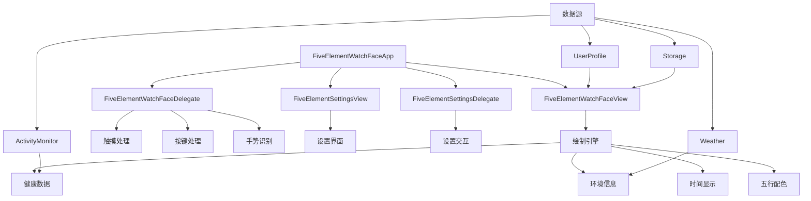

# 五行表盘 (Five Element Watch Face)

一个基于中国传统五行理论设计的Garmin智能手表表盘应用，融合了现代健康监测与古典哲学智慧。通过动态配色系统和智能交互设计，为用户提供独特的个性化表盘体验。

## 项目概述

### 核心特性

- **🎨 五行配色系统**: 基于金、木、水、火、土五行理论的动态配色方案，支持手动切换和自动轮换
- **📊 健康数据集成**: 实时显示心率、步数、卡路里、电池电量等健康指标，支持目标进度显示
- **🌤️ 环境信息**: 集成天气、温度、湿度、UV指数等环境数据
- **🎯 智能交互**: 支持触摸、滑动、按键等多种交互方式，提供触觉反馈
- **⚙️ 个性化设置**: 丰富的自定义选项和配置界面，支持30+个配置项
- **📱 多设备支持**: 兼容fr965、fr255、fr265、fr265s、venu3、venu3s等设备
- **🌍 多语言支持**: 支持中文和英文界面
- **🔋 省电优化**: 智能省电模式和夜间模式

### 技术架构

本项目采用模块化架构设计，基于Garmin Connect IQ SDK 4.0+开发，主要包含以下核心组件：

```
五行表盘应用架构
├── 应用层 (Application Layer)
│   ├── FiveElementWatchFaceApp - 应用主入口
│   └── 生命周期管理
├── 视图层 (View Layer)
│   ├── FiveElementWatchFaceView - 主表盘视图
│   ├── FiveElementDetailView - 详细信息视图
│   └── FiveElementSettingsView - 设置界面视图
├── 控制层 (Controller Layer)
│   ├── FiveElementWatchFaceDelegate - 主表盘交互控制
│   ├── FiveElementDetailDelegate - 详细信息交互控制
│   └── FiveElementSettingsDelegate - 设置界面交互控制
├── 数据层 (Data Layer)
│   ├── ActivityMonitor - 健康数据获取
│   ├── Weather - 天气数据获取
│   ├── UserProfile - 用户配置数据
│   └── Storage - 本地数据存储
└── 资源层 (Resource Layer)
    ├── 字符串资源 (多语言支持)
    ├── 图标资源 (SVG矢量图标)
    ├── 字体资源 (中文字体支持)
    └── 配置资源 (设置选项定义)
```

## 功能模块详解

### 🎨 五行配色系统

五行配色系统是本应用的核心特色，基于中国传统五行理论设计：

| 五行元素 | 主色调 | 寓意 | 适用场景 |
|---------|--------|------|----------|
| 木 (Wood) | 绿色系 (#4CAF50) | 生机勃勃，充满活力 | 运动健身，户外活动 |
| 火 (Fire) | 红色系 (#F44336) | 热情奔放，能量充沛 | 工作学习，激情时刻 |
| 土 (Earth) | 黄色系 (#FF9800) | 稳重踏实，平衡发展 | 日常生活，稳定状态 |
| 金 (Metal) | 白色系 (#FFFFFF) | 清晰明亮，专注思考 | 商务场合，正式活动 |
| 水 (Water) | 蓝色系 (#2196F3) | 深邃宁静，内心平和 | 休息放松，冥想时光 |

**配色切换方式：**
- 🖱️ 点击表盘顶部五行区域
- 👆 左右滑动切换
- 🔘 按下START/ENTER键
- ⚙️ 设置界面手动选择
- 🔄 自动轮换模式（可设置间隔）

### 📊 健康数据监测

应用集成了丰富的健康监测功能：

**实时数据显示：**
- ❤️ **心率监测**: 实时心率 + 心率区间显示
- 👟 **步数统计**: 当前步数 + 目标进度
- 🔥 **卡路里**: 消耗卡路里 + 目标对比
- 🔋 **电池电量**: 剩余电量 + 低电量警告
- ⏱️ **活动时间**: 每日活动分钟数
- 😴 **睡眠质量**: 睡眠评分（如果可用）

**数据展示模式：**
- **标准模式**: 显示核心数据
- **简洁模式**: 仅显示关键信息
- **详细模式**: 显示所有可用数据

### 🌤️ 环境信息集成

**天气数据：**
- 🌡️ 当前温度（支持摄氏度/华氏度）
- 💧 湿度指数
- ☀️ UV指数
- 🌅 日出日落时间
- 🌤️ 天气状况图标

### 🎯 智能交互设计

**触摸交互：**
```
表盘区域划分：
┌─────────────────────┐
│    五行配色区域      │ ← 点击切换配色
├─────────────────────┤
│                     │
│   中心时间显示区     │ ← 点击查看详细信息
│                     │
├─────────────────────┤
│  左侧数据  │ 右侧数据 │ ← 点击切换数据显示
└─────────────────────┘
```

**手势操作：**
- ⬅️ **左滑**: 下一个配色方案
- ➡️ **右滑**: 上一个配色方案
- ⬆️ **上滑**: 显示扩展信息
- ⬇️ **下滑**: 隐藏扩展信息

**按键操作：**
- 🔘 **START/ENTER**: 切换五行配色
- ⬆️ **UP**: 增加亮度
- ⬇️ **DOWN**: 减少亮度
- 🔙 **BACK/LAP**: 重置为默认配色
- 📋 **MENU**: 打开设置界面

## 架构设计与调用关系

### 🏗️ 系统架构图



### 🔄 方法调用关系

**主要调用流程：**

1. **应用启动流程**
```
FiveElementWatchFaceApp.initialize()
├── AppBase.initialize()
├── 加载用户设置
└── getInitialView()
    ├── new FiveElementWatchFaceView()
    └── new FiveElementWatchFaceDelegate()
```

2. **表盘绘制流程**
```
FiveElementWatchFaceView.onUpdate(dc)
├── 清除屏幕背景
├── drawHourMarks(dc) - 绘制时间刻度
├── drawCenterTimeInfo(dc) - 绘制中心时间
├── drawHealthData(dc) - 绘制健康数据
└── drawWatchHands(dc) - 绘制指针
```

3. **用户交互流程**
```
FiveElementWatchFaceDelegate.onTap(touchEvent)
├── 获取触摸坐标
├── 判断触摸区域
│   ├── _isInFiveElementArea() → _cycleFiveElementColor()
│   ├── _isInCenterArea() → _showDetailedInfo()
│   └── _isInDataArea() → _cycleDataDisplay()
└── WatchUi.requestUpdate()
```

4. **数据获取流程**
```
数据更新周期
├── ActivityMonitor.getInfo() - 获取健康数据
├── Weather.getCurrentConditions() - 获取天气数据
├── System.getDeviceSettings() - 获取设备设置
└── Storage.getValue() - 获取用户配置
```

### 📱 设置系统架构

**设置配置层次：**
```
设置系统
├── properties.xml - 默认配置定义
├── settings.xml - 用户界面配置
├── FiveElementSettingsView - 设置界面视图
└── FiveElementSettingsDelegate - 设置交互逻辑
    ├── 五行元素选择 (0-4)
    ├── 数据显示模式 (标准/简洁/详细)
    ├── 颜色主题 (经典/现代/简约)
    ├── 显示开关 (步数/心率/卡路里/电量/天气)
    ├── 时间格式 (12/24小时制)
    ├── 交互设置 (触觉反馈/自动切换)
    └── 电源管理 (省电模式/夜间模式)
```

## 开发环境搭建

### 系统要求

- **操作系统**: macOS 10.14+, Windows 10+, 或 Linux
- **Java**: JDK 8 或更高版本
- **IDE**: Visual Studio Code (推荐) 或其他支持Monkey C的编辑器
- **SDK**: Garmin Connect IQ SDK 4.0.6+

### 安装步骤

#### 1. 安装Connect IQ SDK

1. 访问 [Garmin开发者官网](https://developer.garmin.com/connect-iq/sdk/) <mcreference link="https://developer.garmin.com/connect-iq/sdk/" index="3">3</mcreference>
2. 下载并安装SDK Manager
3. 启动SDK Manager并完成初始设置
4. 登录Garmin Connect账户
5. 下载所需的SDK版本和设备支持包

#### 2. 配置开发环境

**Visual Studio Code配置:**

1. 安装VS Code
2. 安装"Monkey C"扩展插件 <mcreference link="https://www.ottorinobruni.com/getting-started-with-garmin-connect-iq-development-build-your-first-watch-face-with-monkey-c-and-vs-code/" index="4">4</mcreference>
3. 配置SDK路径和开发者密钥

**环境变量配置:**

```bash
# 设置环境变量
export CIQ_HOME=/path/to/connectiq-sdk
export PATH=$PATH:$CIQ_HOME/bin

# 验证安装
monkeyc --version
```

**生成开发者密钥:**

```bash
# 使用SDK工具生成密钥
monkeyc -g developer_key.der
```

#### 3. 项目配置

克隆项目到本地：

```bash
git clone <项目地址>
cd garmin-IQ
```

检查项目结构：

```
garmin-IQ/
├── manifest.xml          # 应用清单文件
├── monkey.jungle         # 项目配置文件
├── source/              # 源代码目录
│   ├── FiveElementWatchFaceApp.mc
│   ├── FiveElementWatchFaceView.mc
│   ├── FiveElementWatchFaceDelegate.mc
│   ├── FiveElementDetailView.mc
│   ├── FiveElementDetailDelegate.mc
│   ├── FiveElementSettingsView.mc
│   └── FiveElementSettingsDelegate.mc
└── resources/           # 资源文件目录
    ├── strings/
    │   └── strings.xml
    ├── layouts/
    ├── drawables/
    └── fonts/
```

## 项目构建与部署

### 🔨 构建流程

**本地构建：**
```bash
# 进入项目目录
cd /path/to/garmin-IQ

# 编译项目（针对所有支持设备）
monkeyc -f monkey.jungle -o FiveElementWatchFace.prg -y developer_key.der

# 针对特定设备编译
monkeyc -f monkey.jungle -d fr965 -o FiveElementWatchFace_fr965.prg -y developer_key.der
```

**支持的设备型号：**
- 🏃‍♂️ **Forerunner 系列**: fr965, fr255, fr265, fr265s
- 💎 **Venu 系列**: venu3, venu3s

### 📦 打包发布

**生成发布包：**
```bash
# 生成 IQ 应用包
monkeyc -f monkey.jungle -e -o FiveElementWatchFace.iq -y developer_key.der

# 验证包完整性
monkeyc --verify FiveElementWatchFace.iq
```

**发布到 Connect IQ Store：**
1. 登录 [Connect IQ Store Manager](https://apps.garmin.com/developer)
2. 创建新应用或更新现有应用
3. 上传 `.iq` 文件
4. 填写应用信息和截图
5. 提交审核

### 🧪 测试与调试

**模拟器测试：**
```bash
# 启动模拟器
connectiq

# 在模拟器中运行应用
monkeydo FiveElementWatchFace.prg fr965
```

**真机调试：**
```bash
# 通过 USB 连接设备
# 启用开发者模式
# 部署到设备
monkeydo FiveElementWatchFace.prg fr965 --device
```

## 技术特性与优化

### ⚡ 性能优化

**内存管理：**
- 🧠 **智能缓存**: 图标和字体资源按需加载
- 🔄 **对象复用**: 减少频繁的对象创建和销毁
- 📊 **数据缓存**: 健康数据和天气信息智能缓存
- 🗑️ **垃圾回收**: 主动释放不需要的资源

**渲染优化：**
- 🎨 **局部刷新**: 仅更新变化的屏幕区域
- 📐 **预计算**: 复杂图形元素预先计算坐标
- 🖼️ **位图缓存**: 静态元素使用位图缓存
- ⏱️ **帧率控制**: 根据电池状态调整刷新频率

### 🔋 电池优化

**省电策略：**
```
电池管理层次：
├── 正常模式 (>50%)
│   ├── 1秒刷新频率
│   ├── 完整动画效果
│   └── 所有传感器数据
├── 节能模式 (20-50%)
│   ├── 5秒刷新频率
│   ├── 简化动画效果
│   └── 核心数据显示
└── 超级省电模式 (<20%)
    ├── 30秒刷新频率
    ├── 静态显示
    └── 仅显示时间
```

**夜间模式：**
- 🌙 **自动切换**: 根据日出日落时间自动启用
- 🔅 **亮度调节**: 夜间自动降低亮度
- 🎨 **配色调整**: 使用深色主题减少功耗

### 🌐 国际化支持

**多语言特性：**
- 🇨🇳 **中文**: 简体中文界面和五行理论说明
- 🇺🇸 **英文**: 完整的英文界面支持
- 🔤 **字体**: 支持中英文混合显示
- 📅 **本地化**: 日期格式和数字格式本地化

### 🔒 数据安全

**隐私保护：**
- 🏠 **本地存储**: 所有用户数据仅存储在设备本地
- 🔐 **权限控制**: 仅请求必要的系统权限
- 📊 **数据脱敏**: 健康数据仅用于显示，不上传
- 🛡️ **安全传输**: 天气数据使用加密传输

## 自定义开发指南

### 🎨 添加新的五行配色

**步骤1: 定义颜色常量**
```monkey-c
// 在 FiveElementWatchFaceView.mc 中添加
private var _customColors = [
    0x8B4513, // 棕色主色
    0xD2691E, // 棕色次色
    // ... 更多颜色定义
];
```

**步骤2: 更新配色数组**
```monkey-c
// 扩展 _fiveElementColors 数组
_fiveElementColors.add(_customColors);
```

**步骤3: 添加字符串资源**
```xml
<!-- 在 strings.xml 中添加 -->
<string id="CustomElement">自定义元素</string>
<string id="CustomElementDesc">个性化配色方案</string>
```

### 📊 添加新的健康数据

**步骤1: 获取数据源**
```monkey-c
// 在 FiveElementWatchFaceView.mc 中添加
private function getCustomHealthData() {
    var info = ActivityMonitor.getInfo();
    // 获取新的健康指标
    return info.customMetric;
}
```

**步骤2: 添加显示逻辑**
```monkey-c
// 在绘制方法中添加显示逻辑
private function drawCustomData(dc) {
    var data = getCustomHealthData();
    // 绘制自定义数据
}
```

### ⚙️ 添加新的设置选项

**步骤1: 更新 settings.xml**
```xml
<setting propertyKey="@Properties.CustomSetting" title="@Strings.CustomSettingTitle">
    <settingConfig type="list">
        <listEntry value="0">@Strings.Option1</listEntry>
        <listEntry value="1">@Strings.Option2</listEntry>
    </settingConfig>
</setting>
```

**步骤2: 更新 properties.xml**
```xml
<property id="CustomSetting" type="number">0</property>
```

**步骤3: 在代码中使用设置**
```monkey-c
var customSetting = Application.Properties.getValue("CustomSetting");
```

## 编译构建

### 开发版本编译

使用VS Code编译：

1. 在VS Code中打开项目
2. 按 `Ctrl+Shift+P` (macOS: `Cmd+Shift+P`) 打开命令面板
3. 选择 "Monkey C: Build for Device"
4. 选择目标设备类型

使用命令行编译：

```bash
# 编译开发版本
monkeyc -d <device_type> -f monkey.jungle -o bin/FiveElementWatchFace.prg -y developer_key.der

# 示例：为fr965编译
monkeyc -d fr965 -f monkey.jungle -o bin/FiveElementWatchFace.prg -y developer_key.der
```

### 测试版本编译

```bash
# 编译测试版本（包含测试代码）
monkeyc -d <device_type> -f monkey.jungle -o bin/FiveElementWatchFace.prg -y developer_key.der -t
```

### 发布版本编译

```bash
# 编译发布版本（优化版本，移除调试信息）
monkeyc -d <device_type> -f monkey.jungle -o bin/FiveElementWatchFace.iq -y developer_key.der -r
```

## 测试指南

### 模拟器测试

#### 启动模拟器

使用VS Code：

1. 点击工具栏的播放按钮
2. 选择目标设备（如"fr965"）
3. 模拟器将自动启动并加载表盘

使用命令行：

```bash
# 启动模拟器
connectiq

# 或指定设备类型
connectiq -d fr965
```

#### 模拟器功能测试

模拟器提供以下测试功能： <mcreference link="https://www.ottorinobruni.com/getting-started-with-garmin-connect-iq-development-build-your-first-watch-face-with-monkey-c-and-vs-code/" index="4">4</mcreference>

- **时间格式切换**: 测试12/24小时制显示
- **背光模式**: 模拟不同光照条件
- **电池状态**: 测试低电量状态显示
- **传感器数据**: 模拟心率、步数等数据变化
- **交互测试**: 测试触摸、滑动、按键响应

#### 调试功能

```bash
# 启动调试模式
monkeyc -d <device_type> -f monkey.jungle -o bin/FiveElementWatchFace.prg -y developer_key.der -g

# 连接调试器
monkeydo bin/FiveElementWatchFace.prg <device_type> -d
```

### 真机测试

#### 设备连接

1. 使用USB线连接Garmin设备到电脑
2. 设备将显示为外部存储设备
3. 确保设备处于开发者模式

#### 应用安装

**方法一：直接复制**

```bash
# 将编译好的.prg文件复制到设备
cp bin/FiveElementWatchFace.prg /Volumes/GARMIN/GARMIN/APPS/
```

**方法二：使用工具安装** <mcreference link="https://www.ottorinobruni.com/getting-started-with-garmin-connect-iq-development-build-your-first-watch-face-with-monkey-c-and-vs-code/" index="2">2</mcreference>

```bash
# 使用monkeydo工具安装
monkeydo bin/FiveElementWatchFace.prg <device_type> -i
```

#### 测试流程

1. **基础功能测试**
   - 表盘显示是否正常
   - 时间更新是否准确
   - 数据显示是否正确

2. **交互测试**
   - 触摸响应测试
   - 滑动手势测试
   - 按键功能测试
   - 菜单导航测试

3. **性能测试**
   - 电池消耗监控
   - 内存使用检查
   - 响应速度测试

4. **兼容性测试**
   - 不同设备型号测试
   - 系统版本兼容性
   - 第三方应用兼容性

## 发布流程

### 准备发布

#### 1. 代码审查和优化

- 代码质量检查
- 性能优化
- 内存使用优化
- 错误处理完善

#### 2. 测试验证

- 完整功能测试
- 多设备兼容性测试
- 长期稳定性测试
- 用户体验测试

#### 3. 资源准备

- 应用图标和截图
- 应用描述和说明
- 版本更新日志
- 用户手册

### Connect IQ Store发布

#### 1. 开发者账户注册

1. 访问 [Garmin开发者中心](https://developer.garmin.com/) <mcreference link="https://developer.garmin.com/connect-iq/sdk/" index="3">3</mcreference>
2. 完成开发者注册流程 <mcreference link="https://developer.garmin.com/downloads/connect-iq/sdks/agreement.html" index="4">4</mcreference>
3. 接受开发者协议
4. 提供必要的身份信息

#### 2. 应用提交准备

**编译发布版本：**

```bash
# 生成发布用的.iq文件
monkeyc -d <device_type> -f monkey.jungle -o release/FiveElementWatchFace.iq -y developer_key.der -r
```

**准备应用资源：**

- 应用图标 (80x80, 60x60像素)
- 应用截图 (设备实际分辨率)
- 应用描述 (多语言支持)
- 关键词和标签

#### 3. 提交审核

1. 登录Connect IQ开发者控制台
2. 创建新应用提交
3. 上传.iq文件和相关资源
4. 填写应用信息和描述
5. 选择支持的设备型号
6. 设置价格和分发区域
7. 提交审核

#### 4. 审核要求

应用必须符合以下要求： <mcreference link="https://developer.garmin.com/connect-iq/app-review-guidelines/" index="2">2</mcreference>

- **功能完整性**: 应用功能完整且稳定
- **用户体验**: 界面友好，操作直观
- **性能要求**: 响应速度快，资源使用合理
- **安全性**: 无恶意代码，数据处理安全
- **合规性**: 符合相关法律法规

#### 5. 发布管理

- **版本更新**: 定期更新和bug修复
- **用户反馈**: 及时响应用户问题
- **数据分析**: 监控下载和使用数据
- **市场推广**: 优化应用描述和关键词

## 项目特色功能

### 五行配色系统

- **金**: 金属质感，代表坚韧和精确
- **木**: 自然绿色，象征生长和活力
- **水**: 流动蓝色，体现灵活和智慧
- **火**: 热情红色，展现能量和激情
- **土**: 稳重黄色，寓意稳定和包容

### 智能交互设计

- **触摸操作**: 点击不同区域切换功能
- **滑动手势**: 左右滑动切换配色，上下滑动查看信息
- **按键支持**: 物理按键快速操作
- **菜单系统**: 完整的设置和配置界面

### 健康数据集成

- **实时监测**: 心率、步数、卡路里等
- **历史数据**: 趋势分析和统计
- **目标管理**: 个人健康目标设定
- **提醒功能**: 运动和休息提醒

## 故障排除

### 🐛 常见问题

**编译错误：**
- ❌ **SDK路径错误**: 检查 `CIQ_HOME` 环境变量设置
- ❌ **设备不支持**: 确认目标设备在支持列表中
- ❌ **资源文件缺失**: 检查 `resources` 目录完整性
- ❌ **密钥问题**: 确保开发者密钥正确生成和配置

**运行时错误：**
- ⚠️ **内存不足**: 减少缓存大小或优化资源使用
- ⚠️ **权限被拒**: 检查 `manifest.xml` 中的权限声明
- ⚠️ **数据获取失败**: 检查传感器可用性和权限
- ⚠️ **显示异常**: 检查设备分辨率适配

**性能问题：**
- 🐌 **刷新缓慢**: 启用省电模式或减少刷新频率
- 🔋 **耗电过快**: 检查后台任务和传感器使用
- 🖼️ **显示异常**: 清除缓存或重置设置
- 📱 **响应迟缓**: 优化绘制逻辑和数据处理

### 🔧 调试技巧

**日志调试：**
```monkey-c
// 添加调试日志
System.println("Debug: " + variableName);

// 条件调试
if (DEBUG_MODE) {
    System.println("Current state: " + currentState);
}
```

**性能监控：**
```monkey-c
// 监控内存使用
var memoryStats = System.getSystemStats();
System.println("Free memory: " + memoryStats.freeMemory);

// 监控执行时间
var startTime = System.getTimer();
// ... 执行代码 ...
var endTime = System.getTimer();
System.println("Execution time: " + (endTime - startTime) + "ms");
```

### 📞 技术支持

**获取帮助：**
- 📖 **官方文档**: [Garmin Connect IQ 开发者指南](https://developer.garmin.com/connect-iq/)
- 💬 **开发者论坛**: [Connect IQ 开发者社区](https://forums.garmin.com/developer/)
- 🐛 **问题报告**: [GitHub Issues](https://github.com/your-repo/issues)
- 📧 **联系作者**: [your-email@example.com](mailto:your-email@example.com)

## 版本历史

### 📋 更新日志

**v1.0.0** (当前版本) - 2024年发布
- ✨ 初始版本发布
- 🎨 五行配色系统完整实现
- 📊 健康数据集成（心率、步数、卡路里、电池）
- 🌤️ 天气信息显示
- ⚙️ 丰富的个性化设置（30+配置项）
- 🌐 中英文双语支持
- 📱 多设备兼容（fr965, fr255, fr265, fr265s, venu3, venu3s）
- 🔋 智能省电优化
- 🎯 多种交互方式（触摸、滑动、按键）

**计划中的功能：**
- 🔮 **v1.1.0**: 添加更多健康指标（血氧、压力、体能状态）
- 🎵 **v1.2.0**: 音乐控制集成
- 🗓️ **v1.3.0**: 日历事件显示
- 🏃‍♂️ **v1.4.0**: 运动模式快捷启动
- 🌙 **v1.5.0**: 月相显示和农历支持
- 🤖 **v2.0.0**: AI智能推荐配色和个性化建议

## 贡献指南

### 🤝 参与贡献

我们欢迎所有形式的贡献，包括但不限于：

**贡献方式：**
1. 🍴 Fork 项目仓库
2. 🌿 创建功能分支 (`git checkout -b feature/AmazingFeature`)
3. 💾 提交更改 (`git commit -m 'Add some AmazingFeature'`)
4. 📤 推送到分支 (`git push origin feature/AmazingFeature`)
5. 🔄 创建 Pull Request

**贡献类型：**
- 🐛 **Bug修复**: 报告和修复问题
- ✨ **新功能**: 添加新的功能特性
- 📚 **文档改进**: 完善文档和注释
- 🎨 **UI优化**: 改进用户界面和体验
- 🔧 **性能优化**: 提升应用性能
- 🌐 **国际化**: 添加新的语言支持

**代码规范：**
- 📝 **注释**: 使用中英文双语注释，重要逻辑必须注释
- 🎨 **格式**: 遵循 Monkey C 代码规范和项目风格
- 🧪 **测试**: 确保新功能经过充分测试
- 📚 **文档**: 更新相关文档和 README
- 🔍 **代码审查**: 提交前进行自我审查

**提交规范：**
```
类型(范围): 简短描述

详细描述（可选）

相关Issue: #123
```

**类型说明：**
- `feat`: 新功能
- `fix`: Bug修复
- `docs`: 文档更新
- `style`: 代码格式调整
- `refactor`: 代码重构
- `test`: 测试相关
- `chore`: 构建过程或辅助工具的变动

### 🎯 开发路线图

**短期目标 (3个月内):**
- 🔧 性能优化和bug修复
- 📱 更多设备型号支持
- 🌐 多语言扩展
- 📊 更多健康数据集成

**中期目标 (6个月内):**
- 🎵 音乐控制功能
- 🗓️ 日历集成
- 🏃‍♂️ 运动模式支持
- 🌙 天文信息显示

**长期目标 (1年内):**
- 🤖 AI智能功能
- 🔗 云端同步
- 📈 数据分析
- 🎮 游戏化元素

## 许可证

本项目采用 MIT 许可证 - 查看 [LICENSE](LICENSE) 文件了解详情。

### 许可证说明

- ✅ **商业使用**: 允许商业用途
- ✅ **修改**: 允许修改代码
- ✅ **分发**: 允许分发
- ✅ **私人使用**: 允许私人使用
- ❗ **责任**: 作者不承担任何责任
- ❗ **保证**: 不提供任何保证

## 致谢

### 🙏 特别感谢

- **Garmin**: 感谢 Garmin 提供优秀的 Connect IQ 开发平台和完善的开发工具
- **中华文化**: 感谢中国传统五行理论的文化启发，为应用提供了独特的设计理念
- **开源社区**: 感谢开源社区的无私分享精神和技术支持
- **测试用户**: 感谢所有参与测试和反馈的用户
- **贡献者**: 感谢所有为项目贡献代码、文档和建议的开发者

### 🌟 技术栈致谢

- **Monkey C**: Garmin 专用的编程语言
- **Connect IQ SDK**: 强大的开发工具包
- **Visual Studio Code**: 优秀的代码编辑器
- **Git**: 版本控制系统
- **Markdown**: 文档编写格式

### 🎨 设计灵感

- **五行理论**: 中国古代哲学思想
- **现代设计**: 简约而不简单的设计理念
- **用户体验**: 以用户为中心的设计原则
- **可穿戴设备**: 针对小屏幕优化的界面设计

---

<div align="center">

### 🌟 如果这个项目对你有帮助，请给它一个 Star！🌟

**让更多人发现这个融合传统文化与现代科技的表盘应用**

[](https://github.com/your-username/garmin-IQ/stargazers)
[](https://github.com/your-username/garmin-IQ/network)
[](https://github.com/your-username/garmin-IQ/issues)
[](https://github.com/your-username/garmin-IQ/blob/main/LICENSE)

[⬆️ 回到顶部](#五行表盘-five-element-watch-face)

</div>

## 技术规范

### 开发语言
- **Monkey C**: Garmin专用开发语言
- **版本要求**: Connect IQ SDK 4.0.6+

### 支持设备
- **fr965**: Forerunner 965
- **venu3**: Venu 3
- **venu3s**: Venu 3S
- **vivoactive5**: Vivoactive 5

### 性能指标
- **内存使用**: < 64KB
- **启动时间**: < 2秒
- **电池影响**: 最小化功耗
- **响应时间**: < 100ms

## 故障排除

### 常见问题

**编译错误：**
```bash
# 检查SDK版本
monkeyc --version

# 清理编译缓存
rm -rf bin/
mkdir bin
```

**模拟器问题：**
```bash
# 重启模拟器
killall simulator
connectiq
```

**设备连接问题：**
- 检查USB连接
- 确认设备开发者模式
- 重启设备和电脑

### 调试技巧

1. **日志输出**
```monkey-c
System.println("Debug message");
```

2. **异常处理**
```monkey-c
try {
    // 代码逻辑
} catch (ex) {
    System.println("Error: " + ex.getErrorMessage());
}
```

3. **性能监控**
```monkey-c
var startTime = System.getTimer();
// 执行代码
var endTime = System.getTimer();
System.println("Execution time: " + (endTime - startTime) + "ms");
```

## 贡献指南

### 开发规范

- 遵循Monkey C编码规范
- 添加适当的注释和文档
- 进行充分的测试
- 提交前进行代码审查

### 提交流程

1. Fork项目仓库
2. 创建功能分支
3. 提交代码更改
4. 创建Pull Request
5. 等待代码审查

## 许可证

本项目遵循MIT许可证，详见LICENSE文件。

## 联系方式

- **项目维护者**: [维护者姓名]
- **邮箱**: [联系邮箱]
- **问题反馈**: [GitHub Issues链接]

---

*本项目致力于将中国传统文化与现代科技相结合，为用户提供独特的智能手表体验。*